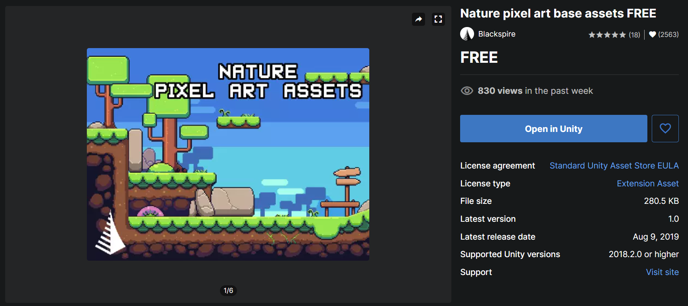

  

# Game Development Project

🤔 Game made using Unity

 Available just for WINDOWS USER 

## This Project Using Some Assets from Unity

[Knight Sprite Sheet]([Knight Sprite Sheet (Free) | 2D Characters | Unity Asset Store](https://assetstore.unity.com/packages/2d/characters/knight-sprite-sheet-free-93897#description))

[Nature pixel art base assets Free]([Nature pixel art base assets FREE | 2D Environments | Unity Asset Store](https://assetstore.unity.com/packages/2d/environments/nature-pixel-art-base-assets-free-151370#description))

